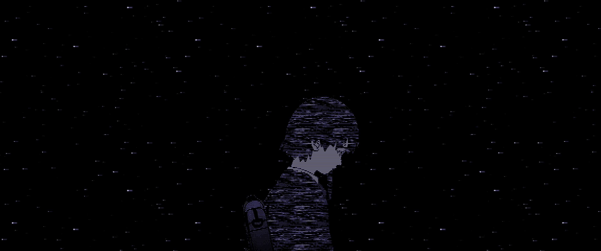

# Hello world! 🌎

I'm Kyle. Right now, I'm a high school senior attending [Phillips Academy](https://www.andover.edu/). I love using math and computer science to solve problems! My work is motivated by a constant curiosity about how the world works and a desire to make knowledge more accessible. By [learning in public](https://www.swyx.io/learn-in-public) and [working with the garage door up](https://notes.andymatuschak.org/Work_with_the_garage_door_up), I hope to engage others in the wonderfully wacky world of programming.

 

    

    <a href="https://commons.wikimedia.org/wiki/File:Trefoil_knot_conways_game_of_life_without_background_and_fitting.gif">The Titou</a>,
    <a href="https://creativecommons.org/licenses/by-sa/4.0">CC BY-SA 4.0</a>,
    via Wikimedia Commons

 

My GitHub profile displays some of the projects I've worked on over the years. Here's what I'm currently building:

- 🧮 A probability calculator for sequences of events in the game Arknights. I'm using [convolution](https://en.wikipedia.org/wiki/Convolution) and the [Fast Fourier transform](https://en.wikipedia.org/wiki/Fast_Fourier_transform) to achieve an exponential speedup over existing methods.
- #️⃣ Implementations of [perfect hash function](https://en.wikipedia.org/wiki/Perfect_hash_function) algorithms. This research area has been quite active in the past decade, and I want to build on theoretical approaches by developing a software library for constructing lookup tables.
- 🤖 A port of [Real-ESRGAN](https://github.com/xinntao/Real-ESRGAN) to the deep learning framework [Burn](https://burn.dev/). Real-ESRGAN is a machine learning algorithm for [super-resolution imaging](https://en.wikipedia.org/wiki/Super-resolution_imaging) and image restoration.
- 📊 3D [force-directed graphs](https://en.wikipedia.org/wiki/Force-directed_graph_drawing). I'm using [Rust](https://www.rust-lang.org/), [wgpu](https://wgpu.rs/), and GPU programming to power high-performance data visualization.

 

    

